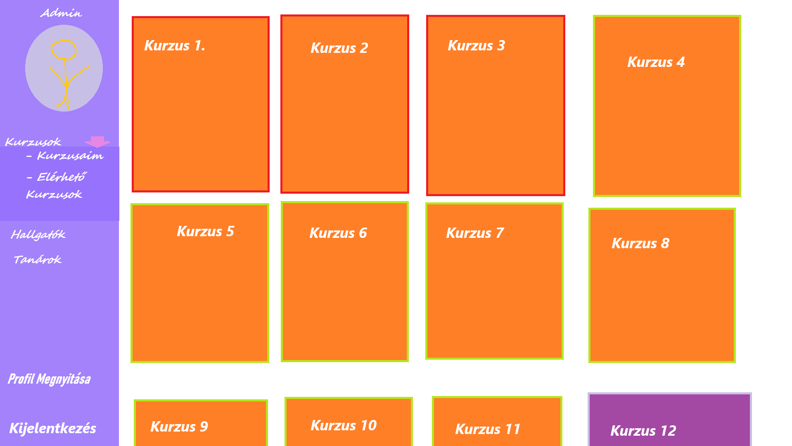

# Funkcionális specifikáció
## 1. Jelenlegi helyzet leírása
* A feladatokat átbeszéltük követelmény specifikácói alapján , a munkakörök ki lettek osztva. Következő lépések , hogy a program alapját előállítsuk és megkezdődjön a fejlesztési folyamatok sokasága.
## 2. Vágyálomrendszer leírás

A projekt elsődleges célkitűzése egy modern online egyetemi tanulmányi feladat megosztó, amely a hallgatók és a tanárok közti egyszerű és gyors kapcsolatot biztosítja. A weboldal a hallgatók, és a tanárok munkáját segítené azzal, hogy egy közös felületen megjelenítené, csak és kizárólag a kellő dokumentumokat, vagy fájlokat. A rendszer eldöntené, hogy a felhasználó tanár-e, vagy diák. Így garantálhatjuk azt, hogy a tanároknak szánt jogokkal a hallgatók nem tudnak élni.
Fontos, hogy a rendszer egyszerűen bővíthető és karbantartható legyen további tárolandó adatokkal, felhasználókkal, valamint hogy a tanárok egyszerűen tudják felügyelni a hallgatók tanulmányait, a hallgatók pedig könnyedén tudják elvégezni a feladatokat.
A weboldalt első körben az egyetemi hallgatók és a tanárok használnák, így ezekhez tartozó biztonsági jogokat fogunk létrehozni. A felhasználók jogainak megadását egy admin végzi majd el, aki a felhasználók adatainak megfelelően fogja majd kinevezni a hallgatókat és a tanárokat. 

Legfontosabb kulcsfunkciók a tanároknak:

- Kurzus létrehozása
- Tananyag/feladatok létrehozása

Legfontosabb kulcsfunkciók a diákoknak:

- A kitűzött feladatokhoz fájl feltöltésének lehetősége

Közös funkciók a tanárok/diákok között:

- Regisztráció
- Be és kijelentkezés
- Profil megtekintése és szerkesztése

## 3. Jelenlegi üzleti folyamatok modellje

A jelenleg használt rendszer nem modern, és nehezen átlátható. A diákok számára nem egyszerű a saját tananyaguk, vagy feladataik megtalálása, valamint a tanároknak a kurzus létrehozás egy hosszas és bonyolult folyamat lehet. Ezt szeretnénk könnyebbé, dinamikusabbá tenni.

## 4. Igényelt üzleti folyamatok modellje

- A felhasználók csak sikeres regisztrációval léphetnek be az oldalra

- A tanár joghoz egy adminnak kell majd jóváhagyni a fiókot, ami után lesz a felhasználónak lehetősége a kurzusok, és tananyagok létrehozásához

- A bejelentkezés után a diákok a saját profiljukhoz rendelt feladatokat elvégezhetik

- A kijelentkezés után a felhasználók nem láthatják az oldalon lévő funkciókat/adatokat

## 5. Követelménylista
 * Oldalak
    - User Regisztráció
        - Bárki elvégezheti
    - Login 
        - ellenőrzi ,hogy tanár-e és a megfelelő objekteket jeleníti meg
    - Kurzus készítő oldal
    - Tananyag készítő oldal
    - Fájl feltöltő oldal
    - Profil szerkeztő és adatmegjelenítő oldal (mehet egybe)
    - Naptár
        - Esemény létrehozó (ha lesz idő)
    - Kurzus igénylése (opcionális)
## 6. Használati esetek
* Bárki képes az oldalon regisztrálni, tanár jogot az admin tud adni egy felhasználónak. A tanuló képes kurzusait megnézni és a kurzus oldalán lévő feladatokat megcsinálni. A tanár felhasználó képes kurzusokat létrehozni és a kurzushoz diákokat hozzáadni. A kurzuson belül tud feladatokat, határidős feladatokat, tananyagokat és egyéb hasznos információkat megosztani a diákokkal. A vendég felhasználó képes a publikus kurzusokat megnézni, de feladatot kitölteni, vagy fájlokat feltölteni nem tud.

## 7. Megfeleltetés, hogyan fedik le a használati eseteket a követelményeket

* A regisztrációs felületen a felhasználó létre tudja hozni a új fiókját mely segítségvel el tudja érni a saját kurzusait, ha pedig már létezik fiókja e-mail cím és jelszava segítségével be tud lépni. Sikeres bejelentkezést követően a user a fiókhoz tartozó adait bármikor képes szerkeszteni legyen szó profilképéről, email címéről vagy akár jelszaváról. Tanári jogosultággal rendelkezők különböző kurzusokat tudnak létrehozni, amelyekben tananyagokat, feladatokat tudnak megosztani különböző felhasználókkal és ezeket tudják idővel frissíteni is. Ezekhez a kurzusokhoz minden belépett user tud hozzáférést kérni kódok segítségével. A felhasználók segítésére szolgál a naptár, mely adott események követésének egyszerűségére törekszik.

## 8. Képernyőtervek

## 9. Forgatókönyvek
* A felhasználó, mint vendég lép be az oldalra, a főoldalon látja a publikus kurzusokat. Annak érdekében, hogy a saját kurzusait lássa be kell jelentkeznie az adataival, vagy regisztrálnia kell. Ha diák felhasználóról van szó, akkor látni fogja a naptárát, ahol különböző események jelennek meg, látja a navigációs bar-t, ahol a saját kurzusaira tud menni a ’Kurzusaim’ fül alatt. A navigációs fülön ott van a ’Kurzushozzáférés igénylése’ gomb, ahol képes olyan kurzusra jelentkezni, amihez még nem lett hozzáadva. A kurzus oldalon látja a kurzushoz tartozó feladatokat, információkat és tananyagokat. Az oldal jobb felső részén láthatja a profilját, itt el tud jutni a profil szerkesztő oldalára, ahol tud magának beállítani jelszót, profil képet és egyéb információkat magáról.
Amennyiben tanárként lépünk be az oldalra, az oldal nagyjából megegyezik, annyi kivétellel, hogy a tanár képes kurzusokat létrehozni és ezen belül a kurzushoz tartozó információkat és a kurzushoz tartozó diákokat változtatni.

## 10. Funkció - követelmény megfeleltetése

| Id | Követelmény | Funkció |
| :---: | --- | --- |
| K1 | Regisztrációs felület | A felhasználó az e-mail címe és jelszava megadásával be tud regisztrálni. |
| K2 | Bejelentkezési felület | A felhasználó az e-mail címe és a megadott jelszava segítségével be tud jelentkezi a felhasználói fiókjába. |
| K3 | Kurzus létrehozása | Egy tanári jogosultsággal rendelkező felhasználó létre tud hozni saját kurzust |
| K4 | Kurzus kezelése | A felhasználó a már létrehozott kurzusokat tudja törölni, valamint azok információit (például tananyag vagy feladatok), diákjait módosítani kedve szerint. |
| K5 | 	Profil kezelése | A felhasználó az éppen bejelentkezett fiók adait meg tudja változtatni, például profil kép, jelszó vagy email cím |
| K6 | Naptár | A naptár segítségével a felhasználó látja a különböző időpontokra kiírt eseményeket |
| K7 | Kurzus igénylés | A felhasználó egy kód segítségvel hozzáférést tud kérni egy adott kurzushoz, amelyre a kurzust létrehozó user tud döntést hozni. |

## 11 Fogalomszótár

- Admin: Adminisztrátor, a tanár felett lévő jog
- Jog: A felhasználók csak a jogukhoz képest vehetik igénybe a funkciókat
- 