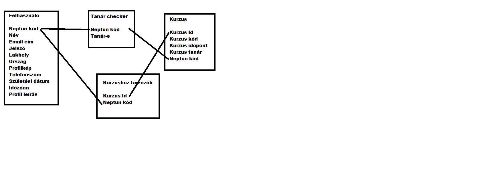

# Rendszerterv
## 1. A rendszer célja
* A rendszer célja az, hogy a tanárok egyszerűen tudják megosztani az óráikhoz tartozó tananyagaikat a diákokkal egy egyszerű online felületen. Ezenkívül a tanároknak lehetőségük van az oldalon dolgozatot íratni, házi feladatot kiadni vagy az órán készült fájlokat feltölteni. 

## 2. Projektterv

### 2.1 Projektszerepkörök, felelőségek:
   * Scrum masters: Zettich Márk
   * Product owner: Cica kft.
   * Junior fejlesztő: Sinka Barnabás, Dobozy Dániel, Sándor Dániel, Horváth Medárd István
     
### 2.2 Projektmunkások és felelőségek:
   * Frontend: Sinka Barnabás, Dobozy Dániel, Sándor Dániel, Horváth Medárd István
   * Backend: Sinka Barnabás, Dobozy Dániel, Sándor Dániel, Horváth Medárd István
   * Tesztelés: Sinka Barnabás, Dobozy Dániel, Sándor Dániel, Horváth Medárd István
     
### 2.3 Ütemterv:

|Funkció                  | Feladat                                | Prioritás | Becslés (nap) | Aktuális becslés (nap) | Eltelt idő (nap) | Becsült idő (nap) |
|-------------------------|----------------------------------------|-----------|---------------|------------------------|------------------|---------------------|
|Követelmény specifikáció |Megírás                                 |         1 |             1 |                      1 |                1 |                   1 |             
|Funkcionális specifikáció|Megírás                                 |         1 |             1 |                      1 |                1 |                   1 |
|Rendszerterv             |Megírás                                 |         1 |             1 |                      1 |                1 |                   1 |
|Program                  |Képernyőtervek elkészítése              |         2 |             1 |                      1 |                1 |                   1 |
|Program                  |Prototípus elkészítése                  |         3 |             8 |                      8 |                8 |                   8 |
|Program                  |Alapfunkciók elkészítése                |         3 |             8 |                      8 |                8 |                   8 |
|Program                  |Tesztelés                               |         4 |             2 |                      2 |                2 |                   2 |

### 2.4 Mérföldkövek:
   * Prototípus átadása

## 3. Üzleti folyamatok modellje

### 3.1 Üzleti szereplők
   * Fiókkal nem rendelkező vendég látogatók
   * Diák(user)
   * Tanár(user)
   * Admin
### 3.2 Üzleti folyamatok
   * User regisztráció:
      * Létező és még nem használt e-mail cím és jelszó beállításával mindenki elvégezheti
   * Beléptető rendszer:
      * Már regisztrált felhasználók beléptetése, helyes adatok megadása után
   * Profil szerkesztés:
      * Belépett fiók adatainak szerkesztése és frissitése
   * Kijelentkezés:
      * Gomb megnyomásával a felhasználó kijelentkeztetése az adott fiókból
   * Kurzus létrehozás és szerkesztés(csak tanár):
      * Csak tanári jogosultsággal rendelkezők képesek új kurzusokat létrehozni és azokat utána szerkeszteni
   * Kurzus hozzáférés:
      * Adott kód segítségével különböző kurzusokra való belépés és annak tartalmai elérése
   * Naptár:
      * Események létrehozása egy adott dátumra és azoknak a megjelenítése
## 4. Követelmények

### Funkcionális követelmények
* *Funkcionális követelmények* 
   - A Weboldal az adatokat, a megjelenitendő Kurzusok adatait adatbázisban fogjuk eltárolni 
* Oldalak
    - User Regisztráció
        - Bárki elvégezheti, diákként regisztrál, az admin teheti tanárrá
    - Login 
        - ellenőrzi ,hogy Tanár-e és a megfelelő objekteket jeleiniti meg
    - Kurzus készítő oldal
    - Tananyag készítő oldal
    - Fájl feltöltő oldal
    - Profil Szerkeztő és adatmegjelenítő oldal (mehet egybe)
    - Naptár
        - Esemény létrehoző (ha lesz idő)
    - Kurzus igénylése (opcionális)

### Nemfunkcionális követelmények

| ID | Megnevezés | Leírás |
| --- | --- | --- |
| K1 | Felhasználóbarát design | A webes felület legyen könnyen használható és intuitív minden usernek. Ne okozzon problémát a navigáció a weboldalon. |
| K2 | Adatbázis átláthatóséga | Nehézségek nélkül hozzá tudjunk férni és kiolvasni az adatokat a táblákból |

### Támogatott eszközök

Számítógépek Windows, Linux vagy macOS operációs rendszerrel

## 5. Funkcionális terv

### 5.1 Rendszerszereplők
 * Vendég: publikus kurzusokat lát
 * Diák: saját és publikus kurzusokat lát, feladatok kitöltése
 * Tanár: saját és publikus kurzusokat lát és hozhat létre, általa készített kurzusok szerkeztése
 * Admin: a felhasználókat kezeli
### 5.2 Menühierarchiák
* Regisztráció
* Belépés
* Kurzusaim
* Kurzushozzáférés igénylése
* Kurzus léterhozása (Tanárnál csak!)
* Profil
* Naptár

## 6. Fizikai környezet

A Weboldal Chrome, Opera és Safari böngészőkön működőképes.
Nincsenek megvásárolt komponensek.

Fejlesztéshez használt eszközök:

- Visual Studio Code 1.87.0
- Github.com
- Trello.com
- Paint.net
- StackEdit.io
- phpmyadmin
- Uiverse.io

## 7. Architekturális terv

### Webszerver

Apache webszerver (Xampp) és Laravel fejlesztői webszerver

### Adatbázis rendszer

PhpMyadmin adatbázis, amit a userek kezelésére és a kurzusok adatainak elérése fogunk használni. Innen kérdezzük le, hogy az adott felhasználó tanár vagy diák-e, ami hozzásegít a weblap rendeltetésszerű használatához.

### A program elérése, kezelése

Apache webszerveren

## 8. Adatbázis terv

## 9. Implementációs terv

Webes felület:
A felületet a Laravel keretrendszerben, és PHP nyelven készítjük el.

Adatbázis:
Az adatbázist phpmyadmin segítségével fogjuk létrehozni, ahol tábláinkat a Laravel migrációk segítségével hozzuk létre. Az adatbázisban tároljuk majd a diákok és tanárok adatait, valamint a kurzusokkal és tananyagokkal kapcsolatos információkat is.

## 10. Tesztterv

A weboldal fejlesztése során folyamatosan szükség van a tesztelésre.
 

Unit és Alfa teszt:
- A tesztek elsődleges célja a funkciók különböző böngészőkben való működése a fejlesztés alatt. Ezeket a fejlesztők végzik, és akkor sikeresek, hogyha a funkciók a különböző böngészőkben vagy operációs rendszerekben megfelelően működnek.

Beta teszt:
- Ez a teszt a felhasználó által készül, a visszajelzésük alapján a hiba vagy probléma kijavítása a cél. A felhasználók különböző operációs rendszereken és böngészőkben próbálják ki a weboldalt.  

Backend:
- Tudnia kell lekérdezni az adatbázisból a megfelelő adatokat.
- Csatlakoznia kell a webes klienshez Windows-on, MacOS-en Android-on és Linux-on is.

## 11. Telepítési terv

 * Fizikai telepítési terv: 
    Egy Online kapcsolatot létrehozni képes mobil vagy irodai eszköz megléte.

 * Szoftver telepítési terv: 
    - Vég felhasználó szinten: Megfelelő bejelentkezési adatok megadása után a       felhasználó jogosultságához valo féle adatok megjelenítése.
    - Egy Mysql adatbázisban tárolt adatrendszer
    - Laravel alapokon nyugvo webes felület    

## 12. Karbantartási terv

Az alkalmazás folyamatos üzemeltetése és karbantartása, mely magában foglalja a programhibák elhárítását, a belső igények változása miatti módosításokat, valamint a környezeti feltételek változása miatt megfogalmazott program-, illetve állomány módosítási igényeket. Ellenőrizni kell, hogy a jövőben, ha kiadnak egy új android vagy windows verziót, akkor kompatibilis-e még a weboldal az új rendszeren, valamint bővíteni kell még több funckióval a weboldalt.

  

Karbantartás folyamata:

**Corrective Maintenance:** A felhasználók által beküldött hibajelentésekben szereplő hibák kijavítása.

  

**Adaptive Maintenance:** A program naprakészen tartása, finomhangolása.

  

**Perfective Maintenance:** A szoftver hosszútávú működése érdekében végzett módosítások, mint például új funkciók, teljesítmény és megbízhatóság javítása.

  

**Preventive Maintenance:** Olyan problémák elhárítása, kijavítása, amelyek még nem tűnnek fontosnak, de később komoly problémákat okozhatnak.
